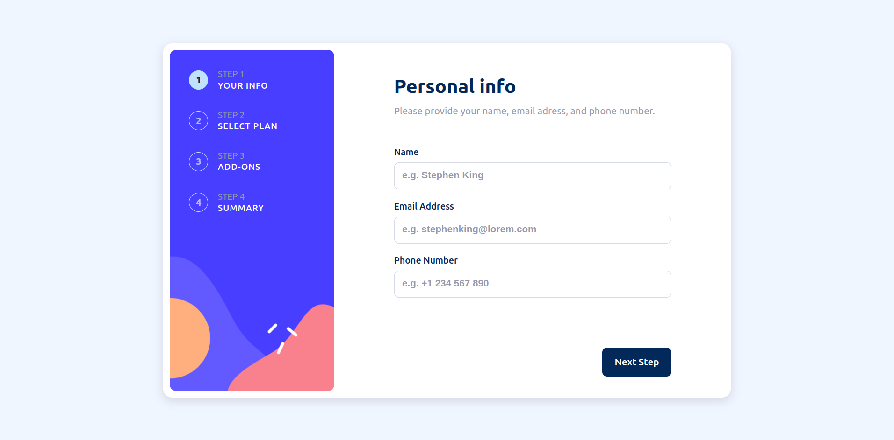

# Frontend Mentor - Multi-step form solution

This is a solution to the [Multi-step form challenge on Frontend Mentor](https://www.frontendmentor.io/challenges/multistep-form-YVAnSdqQBJ). Frontend Mentor challenges help you improve your coding skills by building realistic projects. 

## Table of contents

- [Overview](#overview)
  - [The challenge](#the-challenge)
  - [Screenshot](#screenshot)
  - [Links](#links)
- [My process](#my-process)
  - [Built with](#built-with)
  - [What I learned](#what-i-learned)
  - [Continued development](#continued-development)
  - [Useful resources](#useful-resources)
- [Author](#author)
- [Acknowledgments](#acknowledgments)

**Note: Delete this note and update the table of contents based on what sections you keep.**

## Overview

### The challenge

Users should be able to:

- Complete each step of the sequence
- Go back to a previous step to update their selections
- See a summary of their selections on the final step and confirm their order
- View the optimal layout for the interface depending on their device's screen size
- See hover and focus states for all interactive elements on the page
- Receive form validation messages if:
  - A field has been missed
  - The email address is not formatted correctly
  - A step is submitted, but no selection has been made

### Screenshot

### Links

- Solution URL: [https://github.com/JeongHyunsung/Web_Playground/tree/main/simple-react-app](https://github.com/JeongHyunsung/Web_Playground/tree/main/simple-react-app)
- Live Site URL: [https://web-playground-ss8k.vercel.app/](https://web-playground-ss8k.vercel.app/)

## My process

### Built with

- HTML
- CSS
- JS
- [React](https://reactjs.org/)

### What I learned

1. I was able to learn the process of creating a form and validating the input.

2. In the mobile version, when using buttons outside the form, the method of the child element had to be used in the parent element. This was solved with the useRef hook.

3. React is a library that makes the development process much more intuitive and allows complex functions to be implemented simply.

4. When developing a responsive website, it was convenient to set the font size appropriately according to the device size and use the rem unit when setting the margins or sizes of other elements.

### Continued development

Next, I will design my website using Figma and implement it using React.

## Author

- Website - [Hyunsung Jeong](https://github.com/JeongHyunsung)
- Frontend Mentor - [@JeongHyunsung](https://www.frontendmentor.io/profile/JeongHyunsung)