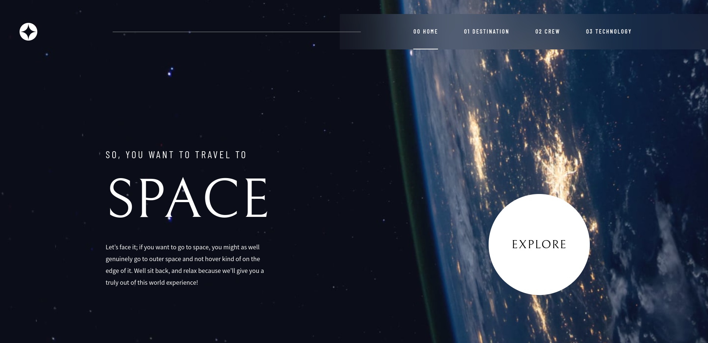

# Frontend Mentor - Space tourism website solution

This is a solution to the [Space tourism website challenge on Frontend Mentor](https://www.frontendmentor.io/challenges/space-tourism-multipage-website-gRWj1URZ3). Frontend Mentor challenges help you improve your coding skills by building realistic projects. 

## Table of contents

- [Overview](#overview)
  - [The challenge](#the-challenge)
  - [Screenshot](#screenshot)
  - [Links](#links)
- [My process](#my-process)
  - [Built with](#built-with)
  - [What I learned](#what-i-learned)
  - [Continued development](#continued-development)
- [Author](#author)
- [Acknowledgments](#acknowledgments)

## Overview

### The challenge

Users should be able to:

- View the optimal layout for each of the website's pages depending on their device's screen size
- See hover states for all interactive elements on the page
- View each page and be able to toggle between the tabs to see new information

### Screenshot

### Links

- Solution URL: [https://github.com/JeongHyunsung/Web_Playground/tree/main/space-tourism-website-main](https://github.com/JeongHyunsung/Web_Playground/tree/main/space-tourism-website-main)
- Live Site URL: [https://space-tourism-website-kappa-indol.vercel.app/index.html](https://space-tourism-website-kappa-indol.vercel.app/index.html)

## My process

### Built with

- HTML
- CSS, JS
- Desktop-first workflow

### What I learned

I focused on making the project similar to the design and making it look good on devices of various sizes. I learned that in order to do responsive web design efficiently, I need to start with an accurate understanding of design and layout.

### Continued development

Next time, I want to study web design using frameworks such as react.

## Author

- Website - [Hyunsung Jeong](https://github.com/JeongHyunsung)
- Frontend Mentor - [@JeongHyunsung](https://www.frontendmentor.io/profile/JeongHyunsung)
